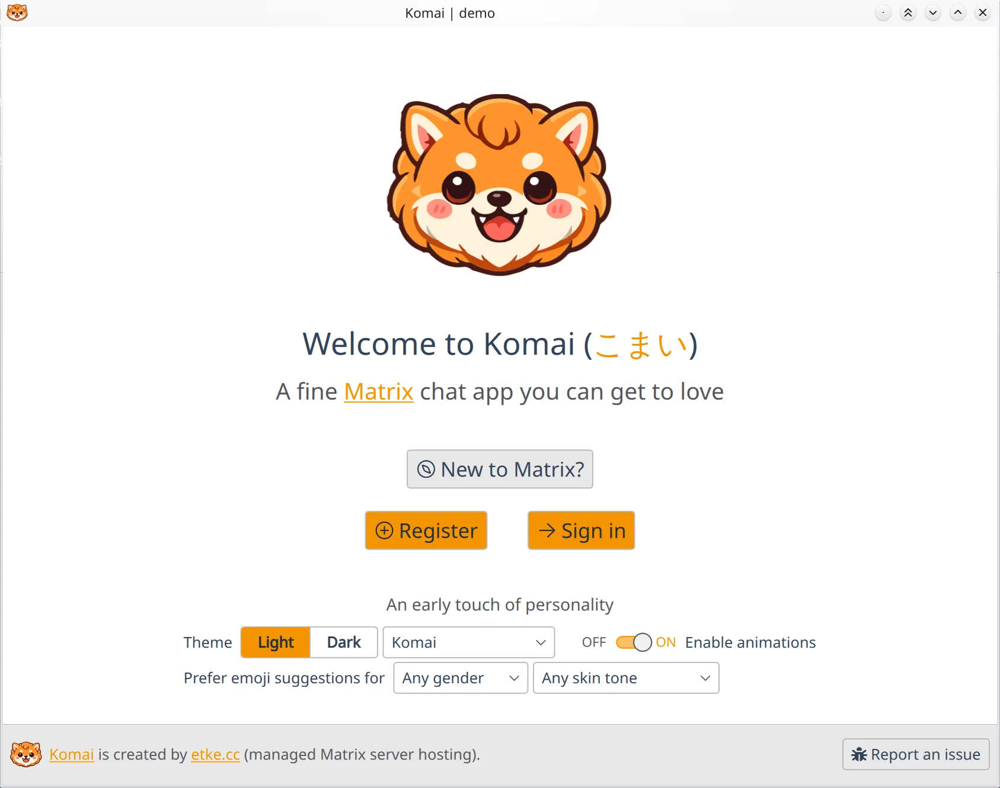
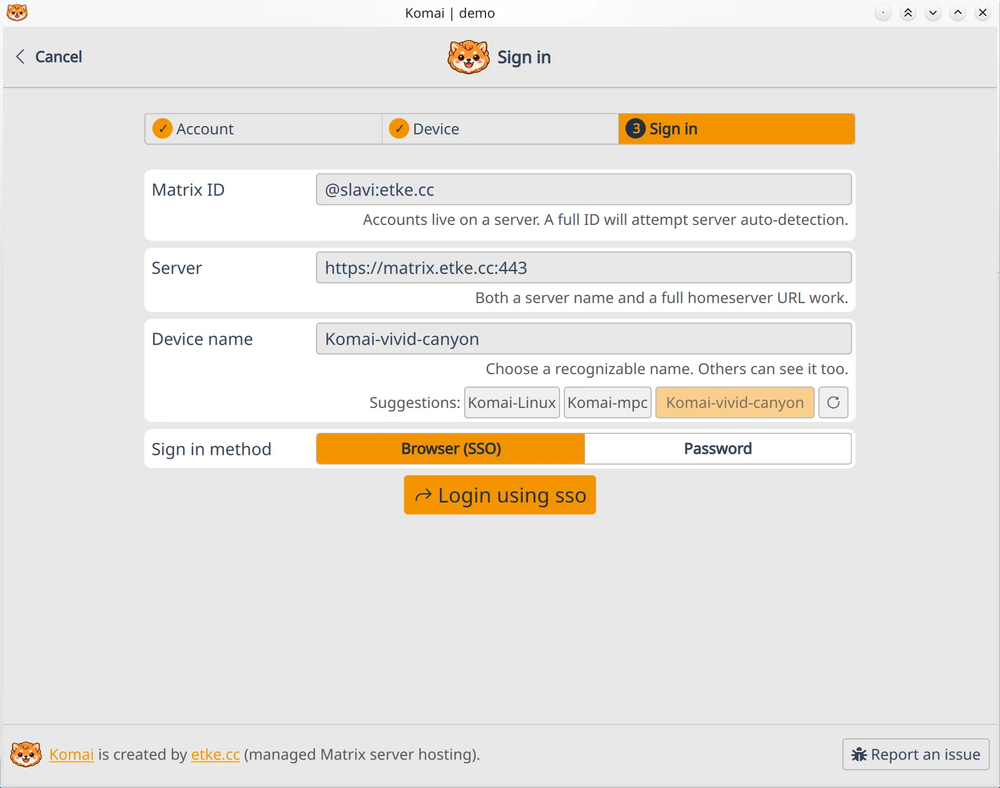
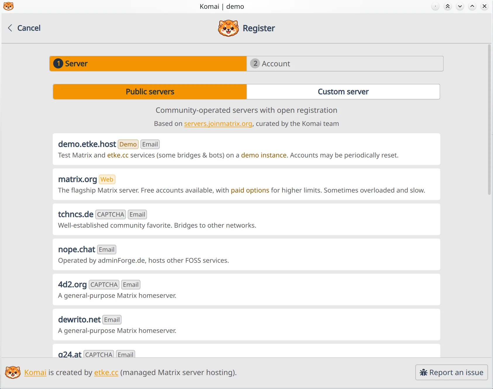
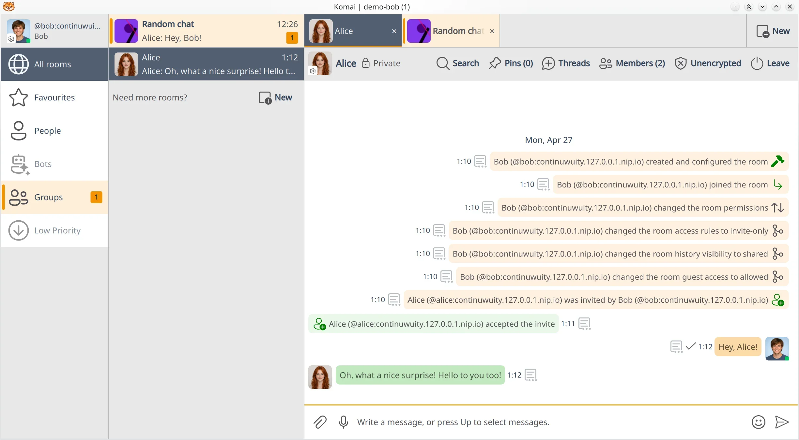
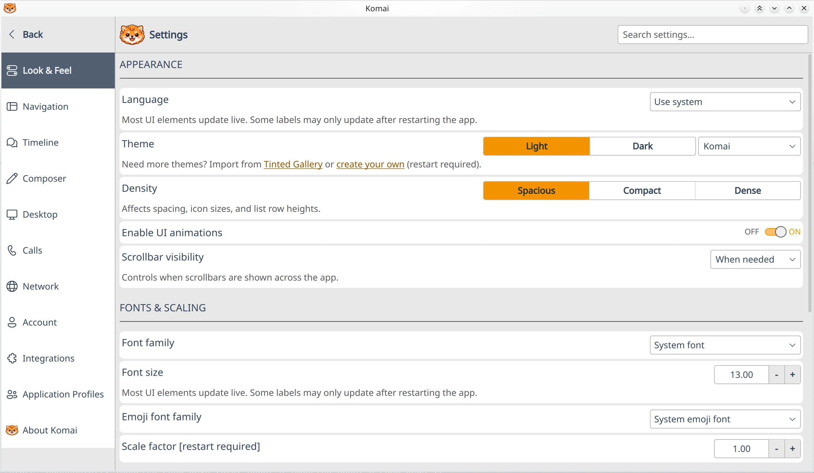
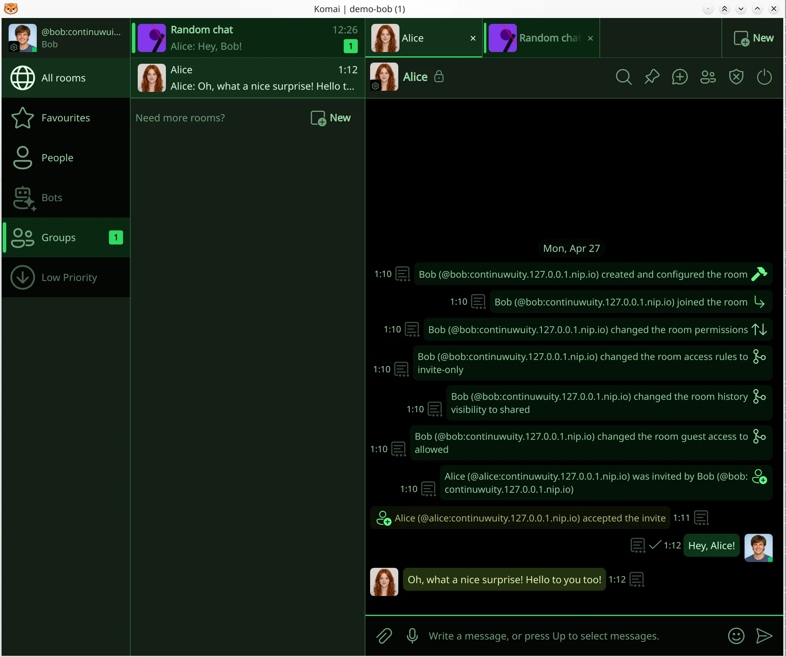

	

<h1 align="center">Komai (<a target="_blank" href="https://en.wiktionary.org/wiki/%E3%81%93%E3%81%BE%E3%81%84">こまい</a>)</h1>
<h2 align="center">A fine <a target="_blank" href="https://matrix.org/">Matrix</a> chat app you can get to love</h2>

<a target="_blank" href="https://komai.chat">komai.chat</a>

🦁 **Komai** is a desktop-first [Matrix](https://matrix.org/) chat application built with [Rust](https://en.wikipedia.org/wiki/Rust_(programming_language)), [C++](https://en.wikipedia.org/wiki/C%2B%2B) and [QML](https://en.wikipedia.org/wiki/QML). It traces its origins to a [usability](https://en.wikipedia.org/wiki/Usability)-focused [fork](https://en.wikipedia.org/wiki/Fork_(software_development)) of [nheko](https://nheko.im/nheko-reborn/nheko), rebuilt around the Rust [matrix-sdk](https://github.com/matrix-org/matrix-rust-sdk) runtime with a growing Rust core.

**🤖 Komai is [built with AI](docs/user-guide/ai.md).** Professional [engineers](https://etke.cc/about/) + AI coding agents ([Claude Code](https://docs.anthropic.com/en/docs/claude-code/overview), [Codex](https://openai.com/index/introducing-codex/)) working together to build a complex native application in a language stack that isn't the team's primary expertise. We think AI in capable hands can deliver above-average results.

Komai was created by the [etke.cc](https://etke.cc/) team, but contributions by anyone are welcome! It's fully [Free Software](https://www.gnu.org/philosophy/free-sw.html) ([GPL-3.0-or-later](LICENSES/GPL-3.0-or-later.txt)), with no [CLA](https://en.wikipedia.org/wiki/Contributor_License_Agreement) and no contributor gatekeeping.

If you're curious about the origin of this project and its name, see the [🦁 Identity](docs/user-guide/identity.md) documentation page.

## 🎯 Design Philosophy

- 🖥️ **Desktop-first UX** — optimized for large screens
- 👓 **Readable and easy to use** — comfortable text, strong contrast, and [Fitts's-law](https://www.nngroup.com/articles/fitts-law/) hit targets
- 🎨 **Yours to shape** — [themeable](docs/user-guide/features/themes.md), [customizable](docs/user-guide/settings/README.md), and [config-management friendly](docs/user-guide/settings/README.md#configuration-management) YAML
- ⚡ **Responsive by design** — native performance is a design constraint
- 🎓 **Educate, don't over-abstract away** — [Arch Linux](https://wiki.archlinux.org/title/Arch_Linux) style: expose Matrix's real concepts
- 🧠 **For both grandma and power users** — neither dumbed down nor buried in complexity

## 🌟 Features

- 💬 [Matrix](https://matrix.org/) messaging with end-to-end encryption support, on the Rust [matrix-sdk](https://github.com/matrix-org/matrix-rust-sdk) runtime
- 📎 [Attachments](docs/user-guide/features/attachments.md) (file, image, audio) with a [built-in media viewer](docs/user-guide/features/media-playback.md) and in-app video playback
- 🎙️ [Voice transcription](docs/user-guide/features/voice-transcription.md) -- long-press Space to dictate speech into the composer (OpenAI-API-compatible)
- ✍️ [Spell checking](docs/user-guide/features/spellcheck.md) -- offline, multi-language, with a bundled English dictionary; picks up your system's Hunspell dictionaries
- 📹 [Element Call](docs/user-guide/features/element-call.md) -- modern [MatrixRTC](https://github.com/matrix-org/matrix-spec-proposals/pull/4143) voice/video calls (1:1 and group), end-to-end encrypted, built right into the app (the older [legacy 1:1 calls](docs/user-guide/features/legacy-calls.md) remain, off by default)
- 😀 [Emoji](docs/user-guide/features/emojis.md) messages with custom emojis and localized [CLDR](https://cldr.unicode.org/) keyword search (`:whiskey` finds 🥃)
- 💬 Replies, [Discord](https://discord.com/)-style [threads](docs/user-guide/features/threads.md), and message forwarding
- 👥 Multi-account support via dedicated [application profiles](docs/user-guide/features/application-profiles.md)
- 🎨 10+ [built-in themes](docs/user-guide/features/themes.md#-built-in-themes) tuned for [WCAG AA contrast](https://www.w3.org/WAI/WCAG22/Understanding/contrast-minimum.html), plus [user themes](docs/user-guide/features/themes.md#️-user-themes)
- 🌐 [30+ languages](docs/maintainers/translations.md), with AI-assisted gap filling
- 🔧 Lots of [configuration settings](docs/user-guide/settings/README.md), grouped into tabs and searchable
- 🧭 Polished [Room Directory](docs/user-guide/features/room-directory.md) with built-in [matrixrooms.info](https://matrixrooms.info/?utm_source=komai&utm_medium=docs&utm_campaign=readme) ([MRS](https://github.com/etkecc/mrs)) search and filters
- 📋 Good support for hundreds of rooms and spaces
- 📑 Browser-style [room tabs](docs/user-guide/features/tabs.md) with pinning -- still rare among Matrix clients
- ⌨️ [Keyboard-driven main chat workflow](docs/user-guide/features/keyboard-shortcuts.md), with human- and [Vim](https://en.wikipedia.org/wiki/Vim_(text_editor))-style shortcuts
- 🎯 [Selection mode](docs/user-guide/features/selection-mode.md) -- drag, `Ctrl`/`Shift`-click, or keyboard-pick a set of messages, then copy / reply / forward / delete them as a batch
- ⚡ Quick, lightweight native app ([Rust](https://en.wikipedia.org/wiki/Rust_(programming_language)), [C++](https://en.wikipedia.org/wiki/C%2B%2B), [QML](https://en.wikipedia.org/wiki/QML)) -- no [Electron](https://www.electronjs.org/)
- 🤖 Automation via [MCP](docs/user-guide/features/automations/mcp.md), [CLI commands](docs/user-guide/features/automations/cli.md), and the [D-Bus API](docs/user-guide/features/automations/dbus.md)
- 🕊️ Fully [Free Software](https://www.gnu.org/philosophy/free-sw.html) ([GPL-3.0-or-later](LICENSES/GPL-3.0-or-later.txt)), no [CLA](https://en.wikipedia.org/wiki/Contributor_License_Agreement), no gatekeeping

Curious where Komai came from and what changed along the way? See 📄 [Differences from nheko](docs/user-guide/differences-from-nheko.md).

## 📸 Screenshots

| Welcome | Sign in | Register |
|:---:|:---:|:---:|
|  |  |  |
| **Main view** | **Settings** | **Dark Matrix theme** |
|  |  |  |

More screenshots are inlined on individual feature pages — see the [👤 User Guide](docs/user-guide/README.md).

## 📥 Installation

Downloads for all platforms are also linked from the [komai.chat](https://komai.chat) homepage.

**🐧 Linux** (`x86_64` and `arm64`): Komai ships as **AppImage**, **Flatpak**, and **Snap** packages on the [GitHub Releases](https://github.com/etkecc/komai/releases) page, plus a [`komai`](https://aur.archlinux.org/packages/komai) package on the Arch Linux AUR.

**🪟 Windows** (`x64`): a portable **ZIP** for Windows 10 (22H2+) and later is attached to each [GitHub release](https://github.com/etkecc/komai/releases). The build includes [Element Call](docs/user-guide/features/element-call.md) voice/video but excludes the [legacy 1:1 call](docs/user-guide/features/legacy-calls.md) stack (`-DVOIP=OFF`). It isn't code-signed, so the first launch shows a SmartScreen warning that needs **More info** -> **Run anyway**.

**🍏 macOS** (`arm64`): a portable **DMG** for macOS 13.3+ on Apple Silicon is attached to each [GitHub release](https://github.com/etkecc/komai/releases). Like the Windows build, it ships [Element Call](docs/user-guide/features/element-call.md) but not the [legacy 1:1 call](docs/user-guide/features/legacy-calls.md) stack (`-DVOIP=OFF`). It isn't code-signed or notarized, so the first launch shows a Gatekeeper warning. On macOS 13/14, right-click `komai.app` -> **Open**; on macOS 15+, open the app once, then go to **System Settings -> Privacy & Security -> Open Anyway**.

See 📄 [Installation](docs/user-guide/installation.md) for download links and install commands. To build Komai yourself, see 📄 [Native build](docs/maintainers/packaging/native.md).

## 📚 Documentation

See 📄 [Documentation](docs/README.md) for the full list of guides, including settings, theming, translations, and packaging.

## 🤝 Contributing

- 👨‍💻 [Development](docs/maintainers/development.md) — building, testing, and code contributions
- 🌐 [Translations](docs/maintainers/translations.md) — improving translations or fixing awkward wording

## 🆘 Support

- 💬 Matrix room: [#komai:etke.cc](https://matrix.to/#/#komai:etke.cc)
- 🐛 GitHub issues: [etkecc/komai/issues](https://github.com/etkecc/komai/issues)

## 🙏 Acknowledgements

Komai started as a fork of [nheko](https://nheko.im/nheko-reborn/nheko) by the Nheko-Reborn team. We're grateful for the original application and the Qt/QML groundwork that made Komai possible.

Komai's Matrix protocol and end-to-end encryption core is built on the [matrix-rust-sdk](https://github.com/matrix-org/matrix-rust-sdk) by the [matrix.org](https://matrix.org/) team — a polished, well-documented Rust runtime that made the move off `mtxclient` + `libolm` tractable for us, and that positions Komai for everything that comes next in the Matrix ecosystem.

- [Boring Avatars](https://github.com/boringdesigners/boring-avatars) — default avatar generation algorithms (Beam, Marble, Bauhaus styles), ported from TypeScript to C++
- [Fluent UI System Icons](https://github.com/microsoft/fluentui-system-icons) — primary icon set (MIT)
- [Font Awesome Free](https://github.com/FortAwesome/Font-Awesome) — supplementary icons and brand logos (CC BY 4.0)
- [Tinted Theming (Base16)](https://github.com/tinted-theming)
- [Element Call](https://github.com/element-hq/element-call) -- embedded [MatrixRTC](https://github.com/matrix-org/matrix-spec-proposals/pull/4143) voice/video calling client (AGPL-3.0-only)
- [Qt WebEngine](https://doc.qt.io/qt-6/qtwebengine-overview.html) -- Chromium-based webview engine that hosts the embedded Element Call client ([licensing](https://doc.qt.io/qt-6/qtwebengine-licensing.html))
