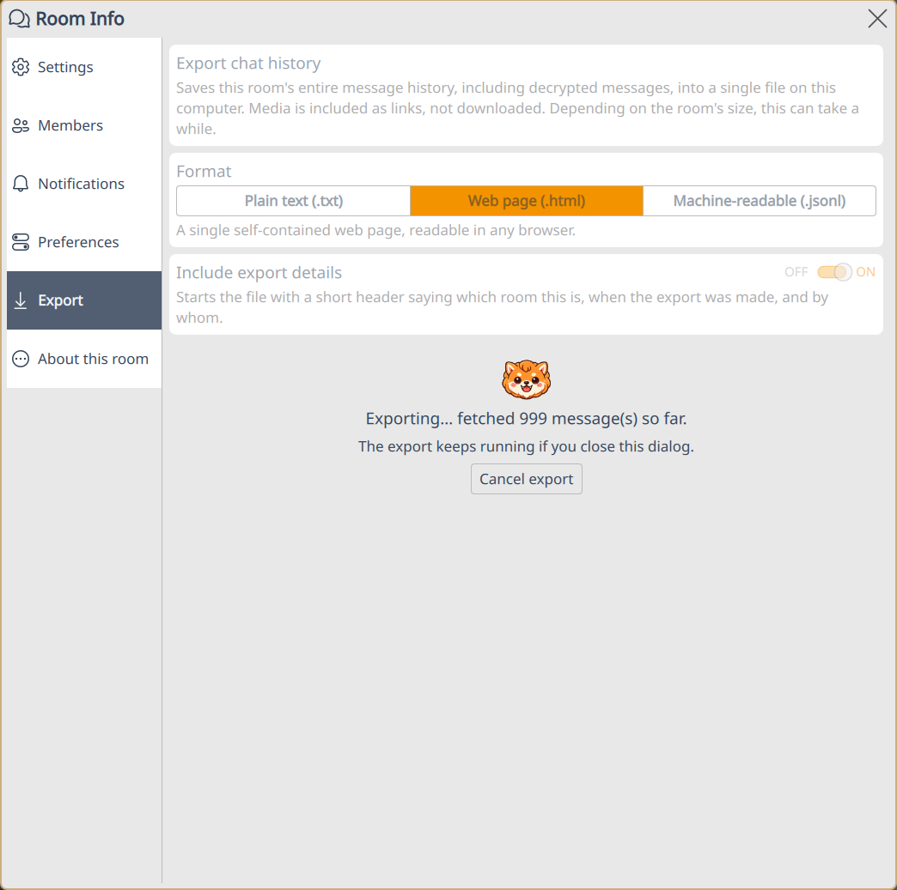

# 📤 Chat Export

Komai can save a room's entire message history into a single file. You can choose between several [formats](#formats).



## Exporting a room

1. Open **Room Info** and pick the **Export** tab.
2. Choose a format and press **Export…**. The suggested filename is timestamped, in the same shape as the [encryption key export](encryption-keys.md): `2026-08-10-1518-matrix-room-<room id>-chat-export.txt`.

**Include export details** (on by default) starts the file with a short header: which room, when, by whom, and how many messages.

The export fetches the full history from your homeserver, with live progress and a Cancel button. It keeps running if you close the dialog; completion shows a notification with **Open** and **Show in folder** actions. Different rooms can export at the same time.

## Formats

### Plain text

One message per line, with day separators and dates in your system's locale format:

```
----- Friday, 7 August 2026 -----

[07/08/26 09:14] Alice (@alice:example.com): Good morning everyone
[07/08/26 09:15] Bob (@bob:example.com):
    > in reply to Alice: "Good morning everyone"
    Morning! Did you see the build failure?
[07/08/26 09:16] Alice (@alice:example.com): I'll clean it up (edited)
    [reactions: 👍 2 (@bob:example.com, @carol:example.com)]
[07/08/26 09:20] Bob (@bob:example.com): [image: screenshot.png] (mxc://example.com/abcDEF)
[07/08/26 09:25] Alice joined the room
```

### Web page

A single self-contained `.html` file with inline styling. Each message carries its Matrix event id as an HTML anchor.

### Machine-readable (JSON Lines)

One JSON object per line, oldest first: ISO 8601 UTC timestamps, stable snake_case tags, nothing localized. Reactions aggregate onto their target with per-emoji sender lists; edits carry the final body plus `"edited": true`; replies and thread replies keep their relation event ids.

```json
{"type":"export_info","format":"komai-chat-export","version":1,"room_id":"!abc:example.com","room_name":"Project Alpha","exported_by":"@alice:example.com","exported_at":"2026-08-10T05:17:42.583Z","message_count":449,"undecryptable_count":0}
{"type":"message","kind":"text","event_id":"$evt1","origin_server_ts":1786338527266,"timestamp":"2026-08-10T05:08:47.266Z","sender_id":"@alice:example.com","sender_display_name":"Alice","body":"Good morning everyone","reactions":[{"key":"👍","count":2,"sender_ids":["@bob:example.com","@carol:example.com"]}]}
{"type":"state","kind":"membership_change","event_type":"m.room.member","change":"joined","target_id":"@bob:example.com","event_id":"$evt2","origin_server_ts":1786338530000,"timestamp":"2026-08-10T05:08:50.000Z","sender_id":"@bob:example.com"}
```

Works directly with [jq](https://jqlang.org/), which consumes [JSON Lines](https://jsonlines.org/) natively:

```sh
jq -r 'select(.sender_id == "@alice:example.com") | .body // empty' export.jsonl
jq -r 'select(.type == "message") | .sender_id' export.jsonl | sort | uniq -c | sort -rn
```

## How messages are rendered

- **Edits**: the final body once, marked `(edited)`.
- **Reactions**: under their message, with count and the reacting users' Matrix IDs.
- **Replies**: a short quote of the message being replied to.
- **Deleted messages**: `[Message deleted]`.
- **Encrypted rooms**: exported decrypted. Messages whose keys are missing even after checking key backup appear as `[Unable to decrypt: <reason>]` and are counted, never dropped.
- **Membership and room changes**: full sentences ("Alice joined the room"), matching the timeline.
- **Thread replies**: inline in timestamp order (JSON Lines preserves the thread root id).

## Media

Media is exported as links, not files: the filename plus its `mxc://` URI. The web page format also links each filename to a [matrix.to](https://matrix.to/) permalink. Direct `https://` download links are not embedded, since Matrix media downloads require authentication and would break outside your session.

## Limitations

- No date-range or message-count options; the export always covers the full history your account can see.
- [Upgraded rooms](https://spec.matrix.org/latest/client-server-api/#room-upgrades) export only the current room; history from predecessor rooms is not followed.
- Polls export as a `[Poll]` placeholder.
