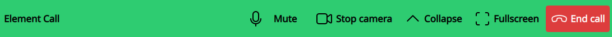
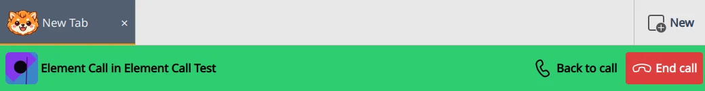
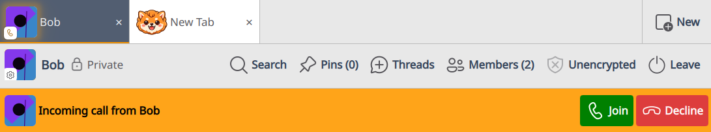
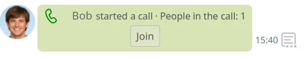

# 📹 Element Call

[Element Call](https://github.com/element-hq/element-call) is modern Matrix
calling ([MatrixRTC](https://github.com/matrix-org/matrix-spec-proposals/pull/4143)):
end-to-end encrypted voice and video, routed through a media server
([LiveKit](https://github.com/livekit/livekit)) instead of peer-to-peer. Komai
builds it in, so you start and join calls from any room without leaving the
app.

It's on by default, and separate from the older [📞 legacy 1:1 calls](legacy-calls.md).

See a [🖼️ Screenshot of an Element Call group call in Komai](../screenshots/element-call.webp).

> **Needs server support.** Calls only work if your homeserver runs a MatrixRTC
> backend (a LiveKit server plus `lk-jwt-service`). Without one, the call screen
> loads but never connects. See [Why won't a call connect?](#why-wont-a-call-connect).

## Starting or joining a call

Use the call button in any room's composer toolbar:

- **Both call types enabled:** the button opens a menu; pick **Element Call**.
- **Only Element Call enabled:** the button starts a call directly.

Element Call works in any room, not just 1:1. When someone else starts a call, a
**Started a call** notice with a **Join** button appears in the timeline and the
room's avatar lights up (see [Following a call around the app](#following-a-call-around-the-app)).

## The call panel

An active call shows as a panel above the room timeline. Element Call draws the call
itself (participant tiles, screen sharing, its own controls); Komai adds a header
bar:

- **Mute** and **Stop camera** -- mirror the call's state; handy when the panel is
  collapsed and Element Call's own buttons are hidden.
- **Collapse** / **Expand** -- shrink to just the header bar (the call keeps running),
  or restore.
- **Fullscreen** -- open the call fullscreen (also via **double-click**; leave with
  **Escape** or the top-right **Exit fullscreen** button).
- **End call** -- leave.

Drag the panel's bottom edge to resize it; the size lasts for the current call only.

> **Microphone and camera** are chosen in Element Call's own in-call settings, not in
> Komai. Komai only offers the quick mute toggles above.

## Following a call around the app

A call keeps running when you leave its room. To get back:

- A **call bar** with **Back to call** and **End call** appears at the top of other
  rooms.
- Rooms with a live call glow in the [📋 room list](room-list.md) and
  [📑 tabs](tabs.md): green if you've joined, the warning color if you haven't.

Closing the room's tab does **not** end the call; audio and video keep going. Reopen
the room (from the [📋 room list](room-list.md) or by [reopening its tab](tabs.md)) to
bring the panel back. To leave, use **End call**.

## Incoming calls

How an incoming call reaches you depends on whether the **caller's** client treated
the room as a direct (1:1) chat or a group, not on how you have it classified.

**Direct chats ring.** A bar with **Join** and **Decline** appears and the ringtone
plays. Declining stops the ring (on your other devices too) but doesn't prevent
joining later, though the caller usually leaves automatically once declined.

**Group calls notify silently.** No ring: just the timeline notice (with **Join**),
the avatar highlight, and a desktop notification if the room's
[notification setting](notifications.md#-per-room-overrides) allows.

Call notifications carry a **Join** action (plus **Decline** for rings) and are
hidden while Komai is focused. Group-call notifications respect the room's
[notification setting](notifications.md#-per-room-overrides) like any message: muted
rooms stay quiet, mention-only rooms notify only when the call addresses you or the whole room (`@room`).

## Settings

Open **Settings → Calls**:

- **Enable Element Call** -- on by default.
- **Ringtone** (under General, shared with legacy calls) -- the sound for incoming
  rings; set to **Mute** to silence them.

Legacy call options sit in the same tab, greyed out unless enabled (see the
[📞 legacy calls guide](legacy-calls.md)).

## Encryption

Calls are end-to-end encrypted when the room is encrypted. In an unencrypted room the
call connects without media encryption. For an encrypted call, use an encrypted room.

## Troubleshooting

### Why won't a call connect?

Almost always, the homeserver has no MatrixRTC backend. Element Call needs a LiveKit
server and `lk-jwt-service` (advertised in `.well-known`); these are part of the
server, not Komai. If the screen loads but never connects, ask your homeserver
administrator. etke.cc and setups that follow the Element Call deployment guide
include it.

### My microphone or camera is wrong

Pick the device in Element Call's in-call settings. Komai remembers them per
[👥 application profile](application-profiles.md) across restarts.

### Where's the Spotlight → Fullscreen button?

Komai hides Element Call's own in-call fullscreen button and gives you a **Fullscreen**
button on the call panel's header bar instead (you can also **double-click** the call,
and leave with **Escape**). Komai's button makes the whole window fullscreen, which
looks cleaner than Element Call's own fullscreen.

## Related

- [📞 Legacy Calls](legacy-calls.md) -- the older 1:1 voice/video stack
- [🔔 Notifications](notifications.md) -- how desktop notifications behave
- [👥 Application Profiles](application-profiles.md) -- call settings are kept per profile
- [⚙️ Settings](../settings/README.md) -- where settings are stored
- [Element Call architecture notes](../../architecture/element-call.md) -- the technical design
