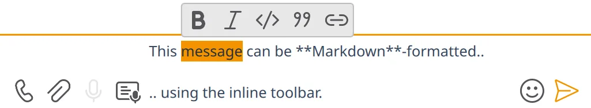

# ⌨️ Keyboard Shortcuts

This page lists the keyboard shortcuts currently documented in Komai.

The examples below use Linux and Windows notation. On macOS, platform-standard shortcuts usually
use `Command` instead of `Ctrl`.

## 🌍 App-Wide Shortcuts

These shortcuts work across the main window unless a more specific control handles them first.

| Shortcut | Action |
| --- | --- |
| `Ctrl+N` | Open the **New** dialog |
| `Ctrl+Shift+N` | Fallback for opening the **New** dialog when `Ctrl+N` is captured by a focused text field |
| `Ctrl+K` | Open a **New Tab** with search |
| `Ctrl+P` | Alternative shortcut for opening a **New Tab** with search |
| `Ctrl+Shift+C` | Focus the [**Communities sidebar**](communities-sidebar.md) list |
| `Ctrl+Shift+R` | Focus the **Room list** sidebar |
| `Ctrl++` / `Ctrl+=` | Increase UI font size |
| `Ctrl+-` | Decrease UI font size |
| `Alt+A` | Jump to the next room with activity |
| `Ctrl+Shift+A` | Fallback for **next room with activity** |
| `Ctrl+Down` / `Ctrl+PgDown` | Switch to the next room |
| `Ctrl+Up` / `Ctrl+PgUp` | Switch to the previous room |
| `Alt+Left` | Navigate back in room history (macOS: `Cmd+[`) |
| `Alt+Right` | Navigate forward in room history (macOS: `Cmd+]`) |
| `Ctrl+Q` | Quit Komai |

## 🧭 Sidebar Lists

These shortcuts apply after you focus the [**Communities sidebar**](communities-sidebar.md) with `Ctrl+Shift+C` or the
**Room list** with `Ctrl+Shift+R`.

| Shortcut | Action |
| --- | --- |
| `Up` / `k` | Move the keyboard cursor up |
| `Down` / `j` | Move the keyboard cursor down |
| `Tab` / `Shift+Tab` | Move focus to the other sidebar list |
| `Home` / `gg` | Jump to the first visible item |
| `End` / `Shift+G` | Jump to the last visible item |
| `Ctrl+U` | Move the keyboard cursor about half a screen up |
| `Ctrl+D` | Move the keyboard cursor about half a screen down |
| `Left` / `h` | In the [**Communities sidebar**](communities-sidebar.md), collapse the focused space |
| `Right` / `l` | In the [**Communities sidebar**](communities-sidebar.md), expand the focused space |
| `Enter` | Activate the focused room or community filter |
| `Escape` | Return focus to the composer textarea |

## 📑 Tabs

These shortcuts manage room tabs.

| Shortcut | Action |
| --- | --- |
| `Ctrl+T` | Open a new tab |
| `Ctrl+W` | Close the current tab |
| `Ctrl+Shift+T` | Reopen the most recently closed tab |
| `Ctrl+Tab` | Switch to the next tab |
| `Ctrl+Shift+Tab` | Switch to the previous tab |
| `Alt+1` … `Alt+9` | Switch to tab by position |

## 💬 Timeline and Room View

These shortcuts apply while you are viewing a room timeline.

| Shortcut | Action |
| --- | --- |
| `Ctrl+F` | Toggle search within the current room |
| `Page Up` | Scroll the timeline up by about one page |
| `Page Down` | Scroll the timeline down by about one page |
| `Escape` | Close the nearest timeline or composer state first. Repeated `Escape` always settles back to the composer |
| Any typed character | Focus the composer and start typing, except while Selection mode is active |

### Selection Mode

Selection mode lets you pick one message, a range, or any mix, and then act on the whole set. See [🎯 Selection Mode](selection-mode.md) for the full feature description, including drag selection and `Ctrl` / `Shift`-modified drag for additive selection.

The keys below apply once Selection mode is active. On some platforms, Komai also keeps the Latin-letter bindings on the same physical keys when you use a non-Latin keyboard layout.

| Shortcut | Action |
| --- | --- |
| `Up` / `k` | Move focus toward older messages |
| `Down` / `j` | Move focus toward newer messages |
| `Left` / `h` | Move focus to the previous Selection mode bar button, or focus the last one from the timeline |
| `Right` / `l` | Move focus to the next Selection mode bar button, or focus the first one from the timeline |
| `Tab` | Focus the first enabled Selection mode bar button, then move to the next one |
| `Shift+Tab` | Move to the previous Selection mode bar button; from the first one, return to the timeline; from the timeline, move to the last room-header action button |
| `Ctrl+U` | Move focus about half a screen toward older messages; from the composer, enter Selection mode and do the same jump |
| `Ctrl+D` | Move focus about half a screen toward newer messages |
| `gg` | Move focus to the oldest currently loaded message |
| `Shift+G` | Move focus to the latest message in the current view |
| `Space` | Toggle whether the focused message is in the explicit selection |
| `?` | Open Selection mode help |
| `Enter` | Open the inline message-actions bar for the selected or focused message and focus its first visible button |
| `Ctrl+C` | Copy the original body for selected messages, or the selected or focused message |
| `Ctrl+Shift+C` | Copy plain text for selected messages, or the selected or focused message |
| `r` | Reply to the selected or focused message |
| `t` | Reply in thread, or continue the selected or focused message's thread |
| `e` | Edit the selected or focused message |
| `f` | Forward selected messages, or the selected or focused message |
| `d` | Delete selected messages, or the selected or focused message |
| `u` | View the selected or focused message as raw JSON |
| `o` | Open the full **Message actions** dialog for the selected or focused message |
| `i` | Exit Selection mode and return to the composer |

Which message does an action use?

- `Ctrl+C`, `Ctrl+Shift+C`, `f`, and `d` use the current selection.
- Other actions use one selected message, or the focused message if nothing is selected.
- With more than one message selected, the other actions are unavailable.

Focus note:

- `Up` / `Down` keep moving through messages.
- `Tab` / `Shift+Tab` move between the timeline, the Selection mode bar, and nearby header controls.

### Inline Message Actions Bar

When you open the inline actions bar from the keyboard, Komai scrolls the selected or focused
message into view first if needed.

| Shortcut | Action |
| --- | --- |
| `Left` / `h` | Move focus to the previous visible inline action |
| `Right` / `l` | Move focus to the next visible inline action |
| `Up` / `k` | In the two-row layout, move focus to the previous visible inline action |
| `Down` / `j` | In the two-row layout, move focus to the next visible inline action |
| `gg` | Focus the first visible inline action |
| `Shift+G` | Focus the last visible inline action |
| `Enter` | Activate the focused inline action |
| `Escape` | Close the inline actions bar and return to Selection mode |

## ✍️ Composer

These shortcuts apply in the message composer.

| Shortcut | Action |
| --- | --- |
| `Ctrl+Shift+V` | Paste as plain text |
| `Ctrl+U` | Enter Selection mode and move about half a screen toward older messages |
| `Ctrl+P` | Load the previous composer draft/history entry |
| `Ctrl+N` | Load the next composer draft/history entry |
| `Ctrl+R` | Toggle voice recording (start, pause, or resume) |
| `Ctrl+.` | Open or close the emoji picker |
| `Ctrl+B` | Toggle **bold** on the selected text |
| `Ctrl+I` | Toggle *italic* on the selected text |
| `Ctrl+E` | Toggle `inline code` on the selected text, or a fenced code block when the selection spans multiple lines |
| `Ctrl+Shift+>` | Toggle a `>` blockquote prefix on every line the selection touches |
| `Ctrl+Shift+L` | Wrap the selection as a Markdown link. Empty selection inserts the `` skeleton and parks the cursor inside the brackets. URL-shaped selections (`https://...`, `matrix://...`) reverse-wrap instead, ready for you to type the label |
| `Space` (long-press) | Hold to record speech for [**voice transcription**](voice-transcription.md); release to insert the transcribed text. Briefer presses still type a literal space. |
| `Tab` | Open the inline completer, or move within completer results. During voice recording, cycle through composer controls |
| `Shift+Tab` | Move the other direction within completer results. During voice recording, cycle through composer controls in reverse |
| `Up` | Move up inside the completer, or enter Selection mode when the caret is already at the start of the top composer line |
| `Down` | Move down inside the completer |
| `Escape` | Close the inline completer popup, cancel an active [**voice transcription**](voice-transcription.md), pause an active voice recording, or otherwise keep you in the composer |
| `Enter` / `Shift+Enter` / `Ctrl+Enter` | Send or insert a newline depending on your configured send-key setting. During voice recording, `Enter` always sends (plus the configured send-key combo) |

Typing note: when the timeline has focus, typing usually moves focus into the composer. On some
platforms or keyboard layouts, some `Ctrl+letter` combinations may also do that even though they
are not dedicated composer shortcuts.

### Formatting toolbar

Selecting text in the composer pops up a small toolbar with one button per
formatting action (Bold, Italic, Inline code, Quote, Link). Click a button to
toggle that formatting on the selection. Each button's tooltip shows its
keyboard shortcut so you can learn them by hovering. Toggling the same action
twice removes it: `**foo**` selected + Bold restores `foo`. Multi-level
formatting works the same way: `***foo***` selected (bold + italic) + Bold
strips the outer pair to `*foo*`; + Italic strips the inner pair to `**foo**`.

## 😀 Emoji / Sticker Picker

Opened with `Ctrl+.` from the composer, or via the emoji/sticker buttons. The search field is focused on open; typing filters results.

| Shortcut | Action |
| --- | --- |
| `Tab` | Move forward between regions: search → grid → categories → settings → close |
| `Shift+Tab` | Move backward between the same regions |
| `Down` / `j` | In the grid: move to the next row. In the search field: jump into the grid. In the categories list: move to the next category |
| `Up` / `k` | In the grid or categories list: move to the previous row/category |
| `Left` / `Right` | Move between emojis within the current grid row |
| `Ctrl+D` / `Ctrl+U` | Move the grid cursor down/up by about half a screen |
| `gg` | Jump to the first row of the grid or the first category |
| `Shift+G` | Jump to the last row of the grid or the last category |
| `Home` / `End` | Jump to the first/last row of the grid or the first/last category |
| `Enter` | Pick the focused emoji/sticker, or activate the focused category/button |
| Any printable character in the grid | Returns focus to the search field and inserts the typed character |
| `Escape` | Close the picker |

## ➕ New Dialog

In the **New** dialog opened by `Ctrl+N`:

| Shortcut | Action |
| --- | --- |
| `J` | Join room |
| `E` | Explore public rooms |
| `D` | New direct chat |
| `R` | New room |
| `S` | New space |

## ↪️ Forward Dialog

In the forward dialog:

- The title changes to match what you are forwarding.
- When you forward several selected messages, the dialog tells you how many will be sent.
- If some selected messages cannot be forwarded, the dialog says they will be skipped.

| Shortcut | Action |
| --- | --- |
| `Up` | Move selection up |
| `Down` | Move selection down |
| `Tab` | Move selection down |
| `Shift+Tab` | Move selection up |
| `Enter` | Pick the selected destination room |
| `Escape` | Cancel the confirmation step |
| `Enter` (during confirmation) | Confirm forwarding |

## 🧾 Message Actions Dialog

In the **Message actions** dialog, available shortcuts depend on the message type and your
permissions.

| Shortcut | Action |
| --- | --- |
| `Up` | Move focus to the previous visible action row |
| `Down` | Move focus to the next visible action row |
| `Tab` / `Shift+Tab` | Move focus forward or backward through the visible actions |
| `Enter` | Activate the focused action |
| `Escape` | Close the dialog |
| `C` | Copy text, or copy media for media events |
| `H` | Copy formatted text |
| `L` | Copy link location |
| `K` | Copy permalink |
| `P` | Pin or unpin the message |
| `M` | Mark the message as read |
| `S` | Save media as |
| `O` | Open media in an external program |
| `I` | Show read receipts |
| `U` | View raw message |
| `E` | View decrypted raw message |
| `D` | Delete message |
| `R` | Report message |

## 🖼️ Media Viewer

In the media overlay / image viewer:

| Shortcut | Action |
| --- | --- |
| `Escape` | Close the overlay |
| `Ctrl+C` | Copy the current media |
| `Left` / `H` | Show the previous media item in gallery mode |
| `Right` / `L` | Show the next media item in gallery mode |
| `Space` | Toggle video playback |
| `Tab` | Move focus into the action buttons |
| `Shift+Tab` | Move focus into the action buttons from the opposite end |

## 👥 Invite Dialog

In **Invite users to room**:

| Shortcut | Action |
| --- | --- |
| `Ctrl+Enter` | Confirm the current selection and send the invites |

## 📝 Notes

- Some shortcuts only work when the relevant popup, dialog, or media overlay is open.
- Some entries use Qt's platform-standard shortcuts, so the exact modifier may differ on macOS.
- This page documents the shortcuts currently implemented in Komai. If a shortcut is missing here,
  it may be unimplemented, platform-specific, or an incidental side effect rather than a deliberate
  user-facing binding.
