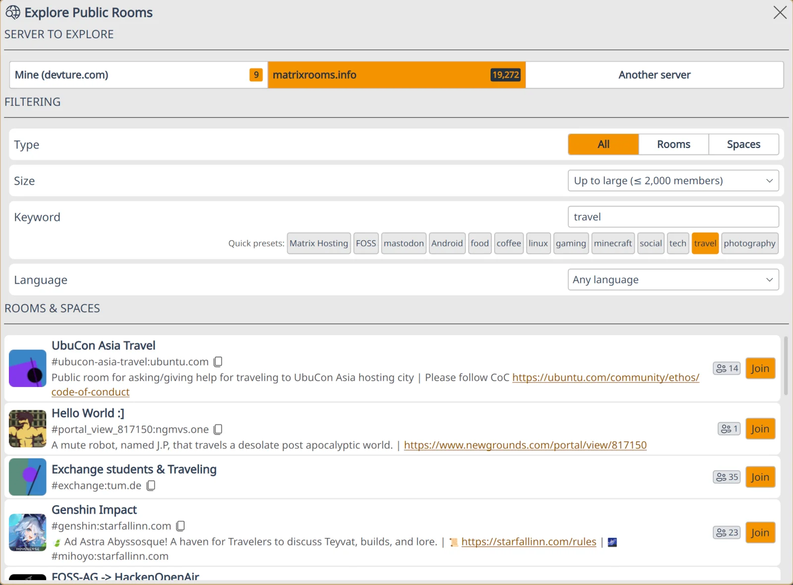

# 🧭 Room Directory

The Room Directory (**Explore Public Rooms**) is the dialog Komai uses to browse and join public Matrix rooms. It can browse your homeserver's directory, a custom server's directory, or a global index powered by [Matrix Rooms Search](#-matrix-rooms-search-mrs).

## 🚪 Opening the dialog

- From the **New Tab** page (visible when no room is selected), click **Explore public rooms**.
- From anywhere, press `Ctrl+N` to open the **New** dialog, then press `E`. See [⌨️ Keyboard Shortcuts](keyboard-shortcuts.md#-new-dialog).
- From **Settings → Integrations → Matrix Rooms Search**, the description text contains a direct link.

## 🗂️ Server tabs

The top of the dialog has up to three tabs, each with a badge showing the number of rooms known to that server:

- **Mine** -- the public room directory of your own homeserver.
- **MRS** (named after your configured [Matrix Rooms Search](#-matrix-rooms-search-mrs) instance, e.g. `matrixrooms.info`) -- a global, cross-homeserver index. Only shown when MRS is enabled.
- **Another server** -- enter any homeserver address (e.g. `matrix.org`) to browse its public directory. Komai suggests recently-seen servers as you type.

If your homeserver's directory is empty and MRS is enabled, Komai will automatically switch to the **MRS** tab so you don't see a blank result list.

## 🔎 Filters

All tabs share the same filter row:

| Filter | What it does |
|---|---|
| **Type** | All / Rooms / Spaces |
| **Size** | *Up to large* (≤ 2,000 members), *Up to very large* (≤ 10,000 members), or *Any* |
| **Keyword** | Free-text search (e.g. *Matrix*, *food*, *coffee*, *tech*). Searches as you type, with a small debounce |

On the **MRS** tab, two extra controls appear:

- **Quick presets** -- one-click keywords like *FOSS*, *linux*, *gaming*, *photography*, *coffee*, etc.
- **Language** -- filter rooms by their declared language. The list is built from your system's locale database, so every language Qt knows about is selectable. Pick *Any language* to clear the filter.

Filter selections are remembered per tab, so switching between **Mine** and **MRS** doesn't reset what you had typed.

Member counts on each result are colour-coded: green for normal rooms, orange for ≥ 2,000 members, red for ≥ 10,000 members. Joining a very large room shows a confirmation prompt, since these can be slow to sync and noisy in your client.

## 🌐 Matrix Rooms Search (MRS)

By default, Komai's homeserver directory only sees rooms hosted on your own homeserver. [Matrix Rooms Search](https://github.com/etkecc/mrs) ("MRS") is a third-party service that crawls many homeservers and indexes their public rooms into a single searchable database -- this is what makes the **MRS** tab work, and it is what unlocks the language filter and keyword presets.

### ⚙️ Configuration

MRS is **enabled by default** and pointed at [matrixrooms.info](https://matrixrooms.info), a large public instance run by [etke.cc](https://etke.cc/?utm_source=komai&utm_medium=docs&utm_campaign=room-directory). You can change both in **Settings → Integrations → Matrix Rooms Search**:

| Setting | Default | Notes |
|---|---|---|
| **Enabled** | On | Turn off to hide the MRS tab entirely |
| **Server** | `matrixrooms.info` | Any [MRS](https://github.com/etkecc/mrs)-compatible instance works -- you can self-host or point at an alternative |

### 🔒 Privacy notes

When you use the MRS tab, your search keywords and the list of rooms you browse are sent to the configured MRS server. This is the same trade-off as using any third-party search engine. If you'd rather not, disable MRS in Settings -- the **Mine** and **Another server** tabs still work and only talk to Matrix homeservers directly.

## 🔗 Related

- [⚙️ Settings → Integrations](../settings/README.md) -- where the MRS toggle and endpoint live.
- [⌨️ Keyboard Shortcuts](keyboard-shortcuts.md) -- shortcuts for the **New** dialog and beyond.
- [🌐 Matrix Rooms Search](https://github.com/etkecc/mrs) -- upstream project on GitHub.
