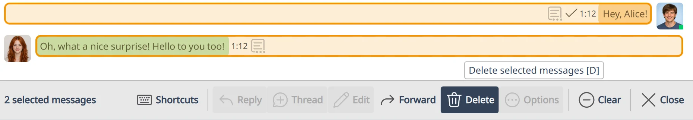

# 🎯 Selection Mode

Selection mode lets you pick one message, a range, or any mix you assemble, and then act on the whole set at once: copy, reply, edit, forward, delete, or open the full **Message actions** dialog.

Despite the keyboard-heavy reputation of similar features in editors like Vim, in Komai Selection mode is just as comfortable with the mouse. The same set of selected messages drives both the visible action bar and the keyboard shortcuts.

## 🎯 Quick start

- Drag across messages to select a range
- `Ctrl+Click` to toggle a single message
- `Shift+Click` to extend a range from your previous click
- `Up` from an empty composer line to jump into the timeline
- `Escape` to leave Selection mode and return to the composer

## ➕ Selecting messages

Komai gives you several ways to enter Selection mode, suited to different habits.

### Click and drag

Click inside a message and drag toward another one. As soon as your cursor crosses into a neighbouring message, the in-bubble text selection is dropped and the rows between the start and the cursor become the selection. Continue dragging to grow the range, or drag back toward the start to shrink it. Release the mouse button to finalize the selection.

By default, a new drag replaces any prior selection, the same way a new drag in a file manager does. To **add** to an existing selection instead, hold `Ctrl` (or `Cmd` on macOS) or `Shift` while you drag: the rows you cross are merged into what was already selected.

The same drag also works on non-text bubbles (images, files, voice messages, and so on). For those, the drag begins after a short movement so a plain click still opens the image, plays the audio, or invokes whatever the bubble normally does.

### Click on individual messages

- `Ctrl+Click` (or `Cmd+Click` on macOS) on a message toggles it in the selection. This is the most direct way to assemble a custom list of messages that aren't next to each other.
- `Shift+Click` extends the selection from the last anchor to the clicked message, including everything in between. Repeated `Shift+Click`s keep extending from the same anchor, so you can grow a range without losing the starting point. With no prior selection, `Shift+Click` behaves like `Ctrl+Click`.

### From the keyboard

- `Up` from the composer, when the caret is already at the start of the top line, jumps into the timeline at the most recent visible message. Komai differs from older chat clients here: `Up` enters Selection mode rather than starting to edit your last message.
- `Ctrl+U` from the composer enters Selection mode and immediately moves about half a screen toward older messages, useful when you want to scroll backwards from the keyboard alone.

Once you're in, see [⌨️ Keyboard Shortcuts → Selection Mode](keyboard-shortcuts.md#selection-mode) for the full key map (`j` / `k`, `gg`, `Shift+G`, action keys like `r` / `e` / `f` / `d`, and so on).

## 🛠️ Acting on the selection

The selection action bar appears at the bottom of the timeline whenever at least one message is selected. It exposes the common per-message and per-set operations:

- **Reply** to a single selected message
- **Edit** a single selected message (only if you sent it)
- **Forward** the selection to another room or DM
- **Delete** the selection (you'll be asked to confirm)
- **Options** opens the full **Message actions** dialog, which is where the Copy actions live, alongside everything else you'd find on a single-message right-click

`Ctrl+C` copies the original message bodies of all selected messages. `Ctrl+Shift+C` copies their rendered plain text. Both work whether the timeline or the action bar has focus.

If you only have one message selected, the per-message actions (reply, edit, view raw JSON, and so on) target that one. With more than one selected, per-message actions are unavailable and the bar limits itself to actions that make sense across a set.

## 🚪 Leaving Selection mode

- `Escape` exits Selection mode and returns focus to the composer
- Click into the composer, or anywhere outside the timeline rows
- Press `i` to drop the selection and put focus back in the composer (Vim-style)

Komai doesn't use Vim's `Escape`-enters-navigation model. Here, `Escape` always moves you back toward typing: it closes the nearest active sub-state first, then settles in the composer.

## See also

- [⌨️ Keyboard Shortcuts → Selection Mode](keyboard-shortcuts.md#selection-mode) for the full key map
- [💬 Threads](threads.md) for how Selection mode interacts with thread views
