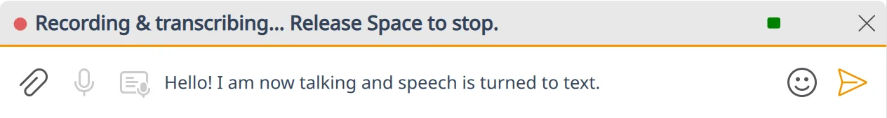

# 🎙️ Voice Transcription

Hold-to-talk speech-to-text in the composer. Long-press `Space` (or click & hold the microphone button next to the voice-message button), speak, release — your words appear at the cursor as text. Backed by any OpenAI-compatible transcription API: OpenAI cloud, [whisper.cpp's `whisper-server`](https://github.com/ggerganov/whisper.cpp/tree/master/examples/server), [AMD Lemonade Server](https://github.com/lemonade-sdk/lemonade), [LocalAI](https://localai.io/), or anything else that speaks the same wire format.




## 🚀 Quick start

1. Open **Settings → Integrations → Voice transcription**.
2. Pick a **Mode**:
   - **Batch (one-shot)** — record, send the whole clip at the end, get the transcript back. Works with every OpenAI-compatible server.
   - **Realtime (streaming)** — text streams in as you speak. Requires a server that supports the OpenAI Realtime transcription protocol.
3. Pick a **Preset**: **OpenAI cloud** locks the API URL to `https://api.openai.com/v1`; **Custom server** lets you point at a local transcription server.
4. Fill in the API key (if required), the model, and optionally a language code or vocabulary prompt.
5. In any room, **long-press `Space`** in the composer textarea. Speak. Release `Space`. The transcript replaces nothing — it lands at your cursor, so you can keep typing around it.


## ✋ Three ways to trigger it

| Surface | How | Stop & transcribe |
| --- | --- | --- |
| **Long-press `Space`** in the textarea | Hold `Space` past ~350 ms | Release `Space` |
| **Microphone button** next to the voice-message button — **hold mode** | Press and hold the button past ~350 ms | Release the button |
| **Microphone button** — **click-toggle mode** | Quick-click the button (no hold) | Click the button again, or click **Stop** in the banner |

`Esc` cancels at any point — recording is discarded, no API call is made, no text is inserted.

A short tap on `Space` (under the long-press threshold) types one literal space, the way it always has — no accidental triggers from normal typing.


## 🎚️ The composer toggle

`Settings → Composer → Input → Voice transcription` is the master switch.

- **On** (default): the long-press gesture and the microphone button both work. If the API isn't configured yet, the banner that appears tells you so and gives you a one-click jump to **Integrations → Voice transcription**.
- **Off**: long-press `Space` is unhooked entirely — repeated spaces just like normal Qt key-repeat. The microphone button is hidden. Flip this off to silence the gesture.


## ⚙️ Configuration shape

Two YAML sections control transcription. The composer-side toggle lives in `composer`; the third-party API config lives in `integrations`.

```yaml
composer:
  input:
    transcription:
      enabled: true                     # master toggle (defaults to true)

integrations:
  transcription:
    provider: openai_batch              # openai_batch | openai_realtime
    api_url: "https://api.openai.com/v1"
    model: "whisper-1"                  # batch default; for realtime: gpt-4o-mini-transcribe
    language: ""                        # ISO-639-1, empty = autodetect
    prompt: ""                          # vocabulary/style hint, optional
    by_room:
      "!example:matrix.org":
        provider: openai_realtime
        model: gpt-4o-mini-transcribe
        language: bg
      "!other:matrix.org":
        api_url: "http://localhost:8080/v1"
        model: base.en
```

The `api_key` is intentionally **not** in `config.yml` — it lives in your OS keychain (or in `~/.config/komai/profiles/<profile-id>/secrets.yml` if you've set `secrets.provider: file`). Set it from the Settings page; it's never written to disk in plaintext.

Per-room overrides are partial: anything you don't override falls back to the global value. Per-room API keys are stored under hashed keychain entries — see [Settings: Profile Location](../settings/README.md#profile-location) for paths.


## 🧠 Choosing a model

Leave **Model** blank in the settings page and Komai picks a sensible default for the selected **Provider**:

- **Batch** → `whisper-1`. Universally accepted: it's OpenAI's batch transcription model id, and every OpenAI-compatible local server we surveyed (`whisper.cpp`'s `whisper-server`, AMD Lemonade, LocalAI, vLLM) accepts it as a passthrough — the server uses whatever Whisper model it has loaded regardless of the name you send. `whisper-1` is the safe choice if you're not sure.
- **Realtime** → `gpt-4o-mini-transcribe`. `whisper-1` doesn't actually stream — it returns the full transcript at the end, which defeats the point of realtime. `gpt-4o-mini-transcribe` is OpenAI's cheaper streaming-capable model and is the model id local servers that support realtime (Lemonade v9.4.1+) target.

Override Model when you want something different:

- **Better cloud accuracy.** OpenAI's `gpt-4o-transcribe` is more accurate than `whisper-1` and `gpt-4o-mini-transcribe`, at higher cost.
- **A specific local model.** Some servers (e.g. `whisper.cpp`'s `whisper-server` with `--inference-path`) ignore the Model name; others key off it. Check your server's docs.
- **A non-OpenAI cloud provider's compatibility model id.** Groq, Deepgram, AssemblyAI all expose OpenAI-compatible endpoints with their own model ids.

Bumping the default in a future Komai release transparently upgrades anyone who left the field blank — that's why the YAML stores `model: ''` instead of writing a model id at install time.


## 🌐 Compatible providers

### Cloud (batch + realtime)

- **OpenAI** — both `whisper-1` (batch) and `gpt-4o-transcribe`/`gpt-4o-mini-transcribe` (batch + realtime).
- **AMD Lemonade Server v9.4.1+** — local-first OpenAI-compatible server with batch *and* realtime.

### Cloud (batch only via OpenAI-compatible layer)

- **Groq** — fast Whisper-on-LPU.
- **Deepgram** — has an OpenAI-compatible compatibility shim.
- **AssemblyAI** — has an OpenAI-compatible compatibility shim.

### Local (batch only)

- **whisper.cpp's `whisper-server`** — set the inference path:
  ```sh
  whisper-server -m models/ggml-base.en.bin --inference-path /v1/audio/transcriptions
  ```
  Then point Komai at `http://localhost:8080/v1`. whisper.cpp 1.8.3+ uses your integrated GPU via Vulkan for ~12× speedup.
- **LocalAI** — set up a Whisper backend; point Komai at the LocalAI base URL.
- **vLLM** — `vllm serve` with a transcription-capable model.

If your provider speaks `POST {base_url}/audio/transcriptions` with multipart `file` + `model` fields, batch mode will work without any per-vendor adapter on Komai's side.


## 💡 Recording UX

While the gesture is active, an in-composer banner replaces the textarea:

- **Recording** — pulsing red dot, an audio-level meter so you can confirm the mic is hot, and copy that depends on how you started: "Release `Space` to stop", "Release the button to stop", or "Click **Stop** to finish, `Esc` to cancel" for click-toggle mode.
- **Transcribing** — a spinner while we wait for the API response (batch only; realtime fills text in as you speak).
- **Transcription failed** — the error reason inline, with `Esc` or a dismiss button to clear it.
- **Voice transcription is enabled but not configured** — appears when you trigger the gesture before configuring an API. The banner has an **Open Settings** button that drops you on this very settings page.


## 🛠️ Troubleshooting

- **"Invalid API key"** — check the API key in **Settings → Integrations → Voice transcription**. Make sure it has not been pasted with a leading or trailing space (the Settings field auto-trims, but a copy-paste through some intermediate apps can sometimes leave whitespace inside the value).
- **"Network error"** — confirm the API URL is reachable from your machine. For local servers (`whisper-server`, Lemonade, LocalAI), make sure the server is running and the port matches what you've configured. For cloud providers, check your firewall.
- **No microphone activity** — verify Komai has microphone permission at the OS level (PipeWire/PulseAudio on Linux, Privacy & Security on macOS, mic access on Windows). The banner's audio-level bar is your in-app sanity check: if it's flat while you speak, the mic is not reaching Komai.
- **Recording cuts off after a minute** — Komai soft-caps very long recordings to keep accidental holds from turning into 25 MB uploads. Release and re-trigger if you need to continue.
- **Settings UI doesn't reflect a hand-edited `config.yml`** — restart Komai after editing `config.yml` directly so Komai picks up the new values; the in-app Settings UI reads its model at load time.


## 🔗 Related

- [⌨️ Keyboard Shortcuts](keyboard-shortcuts.md) — the long-press `Space` gesture lives in the **Composer** section.
- [⚙️ Settings](../settings/README.md) — where `config.yml` lives, secrets storage, and per-profile config.
